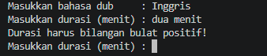
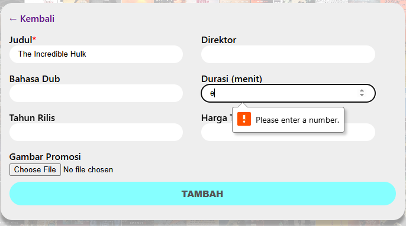
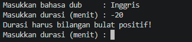
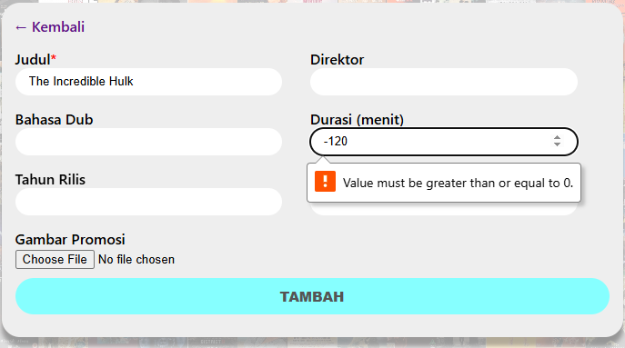
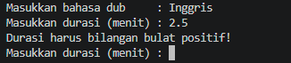
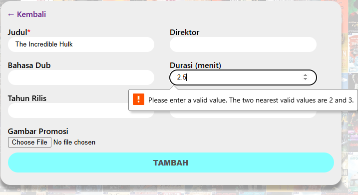
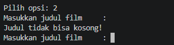
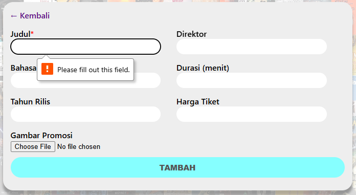

> "Saya Rama Taufik Azkia dengan NIM 2508497 mengerjakan Tugas Praktikum 1 dalam mata kuliah Desain dan Pemrograman Berorientasi Objek untuk keberkahanNya maka saya tidak melakukan kecurangan seperti yang telah dispesifikasikan. Aamiin."

*— Janji*

# GARIS BESAR
CINEMA ABSOLUT merupakan aplikasi yang mengelola data film. Tersedia dalam 2 *interface*: CLI (C++, Java, Python) dan *web* (PHP). Setiap implementasi memiliki 7 atribut utama:
  1. ID, atribut angka unik yang dihitung otomatis oleh sistem. Pada implementasi CLI, ID diambil dari indeks *record* pada *array*, sehingga dapat berubah jika indeks sebelumnya dihapus, **namun** dipastikan tetap unik. Khusus implementasi *web*, ID tidak berubah dan dihitung dari ID terbesar sebelumnya + 1 (1 jika merupakan record pertama), karena adanya penyimpanan gambar;
  2. Judul (`title`), atribut wajib yang menyimpan data judul film;
  3. Direktor (`director`), atribut yang menyimpan data direktor film. Bernilai '-' jika kosong;
  4. Bahasa (`lang`), atribut yang menyimpan bahasa utama yang digunakan dalam film. Bernilai '-' jika kosong;
  5. Durasi (`minutes`), atribut yang menyimpan durasi film dalam menit. Bernilai 0 jika kosong;
  6. Tahun rilis (`year`), atribut yang menyimpan data perilisan perdana film. Bernilai 0 jika kosong;
  7. Harga tiker (`price`), atribut yang menyimpan data harga tiket. Bernilai 0 jika kosong.

**Khusus** untuk **implementasi web**, terdapat atribut tambahan 'Gambar promosi' (`img_url`). Hal ini yang menyebabkan 'ID' implementasi *web* dibuat tidak berubah, karena nama gambar disimpan sesuai ID-nya.

# FITUR
1. Tambah data baru;
2. Lihat data;
3. Ubah data berdasarkan ID;
4. Hapus data berdasarkan ID;
5. Penyimpanan data berbasis `session` di implementasi *web*;
6. Pencarian data berdasarkan 'Judul' dan 'Direktor' film.

# ERROR HANDLING
*Error handling* dibawah berlaku untuk semua implementasi. Saat terjadi *error*, program akan mengembalikan pesan dan meminta ulang *input* yang sesuai.
  1. Mencoba *input string* / karakter non-angka pada atribut angka:

  | CLI | WEB |
  | --- | --- |
  |  |  |
  2. Mencoba *input* angka negatif pada atribut angka (semua atribut angka harus positif atau 0):

  | CLI | WEB |
  | --- | --- |
  |  |  |
  3. Mencoba *input* angka desimal pada atribut angka (semua atribut angka harus bilangan bulat):

  | CLI | WEB |
  | --- | --- |
  |  |  |
  4. Mencoba mengosongkan atribut 'Judul':

  | CLI | WEB |
  | --- | --- |
  |  |  |

# DOKUMENTASI

